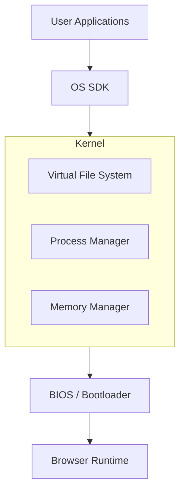

# 🌌 NA.os — Advanced Browser OS

<p align="center">
  
  
  
  
</p>

---

**NA.os** is a high-performance, lightweight operating system kernel and desktop environment designed to run natively within any modern web browser. It features a genuine **Microkernel Architecture**, a **Virtual File System (VFS)**, and a robust **Process Manager**.

---

## 🚀 Key Features

- 🧠 **Kernel Architecture**: Real process management, memory tracking, and internal event bus.
- 📁 **Virtual File System**: Fully functional VFS with path security and persistence.
- ⚡ **Ultra-Fast**: Powered by SolidJS for reactive, high-performance UI rendering.
- 🛡️ **Security-First**: Path validation, sandboxing, and Unix-style permission models.
- 🎹 **Terminal-First**: Built-in TTY for system-level control.
- 🎨 **Neon Aesthetics**: Customizable neon themes, scanline effects, and slick animations.

---

## 📋 Road Map

| Feature | Status | Description |
| :--- | :--- | :--- |
| **Microkernel** | ✅ 100% | Core drivers, Process/Memory Manager. |
| **VFS** | ✅ 100% | IndexedDB backed Virtual File System. |
| **Event Bus** | ✅ 100% | Pub/Sub system for inter-component comms. |
| **GUI Shell** | ⏳ 40% | Compositor, Taskbar, and Desktop. |
| **Core Apps** | ⏳ 20% | Terminal, Settings, and Shell. |
| **External API** | ⏳ 10% | SDK for 3rd-party application development. |

---

## 🏗️ System Architecture



---

## 🛠️ Tech Stack

- **Core**: [SolidJS](https://www.solidjs.com/) — The fastest reactive UI library.
- **Backend**: Node.js + [Fastify](https://www.fastify.io/) + [Socket.io](https://socket.io/) for real-time synchronization.
- **Styling**: [Tailwind CSS](https://tailwindcss.com/) + [Framer Motion](https://www.framer.com/motion/) for animations.
- **Persistence**: SQLite (WebSQL/IndexedDB) + [Drizzle ORM](https://orm.drizzle.team/).
- **Engine**: [Vite](https://vitejs.dev/) — Lightning-fast HMR and build pipelines.

---

## 📦 Setup & Development

### 1. Installation
```bash
# Clone the repository
git clone https://github.com/4yangXYAO/4x-Web-os.git
cd 4x-Web-os

# Install dependencies
npm install
```

### 2. Launch Development Mode
```bash
# Start the frontend dev server
npm run dev

# (Optional) Start the backend services
npm run server
```
*Frontend will be available at: `http://localhost:5173`*

### 3. Running Tests
```bash
# Run unit and integration tests
npm test

# Run tests in UI mode
npm test:ui
```

---

## 📖 API Documentation (SDK)

### **Event System**
```typescript
import { on, emit } from './services/event-bus';

on('system:ready', () => {
    console.log("Kernel is active.");
});

emit('ui:toast', { message: "System initialized." });
```

### **File Operations**
```typescript
import { vfs } from './core/fs';

// Writing to VFS
await vfs.writeFile('/home/user/notes.txt', 'Welcome to WEB.OS');

// Reading from VFS
const content = await vfs.readFile('/home/user/notes.txt');
```

---

## 📊 System Specs

| Category | Capability |
| :--- | :--- |
| **Concurrency** | Max 32 Processes |
| **Memory Quota** | 50MB per Application |
| **File Limit** | 10MB per Entry |
| **Network** | WebSocket over Socket.io |
| **Security** | Sandboxed Execution Environment |

---

## 📜 License

Distributed under the **MIT License**. See `LICENSE` for more information.

---

<p align="center">
  <i>Built with MIE for the future of web-based environments.</i>
</p>
