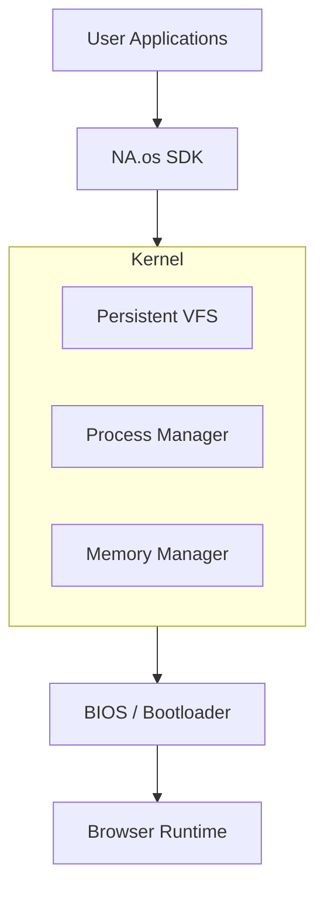

# 🌌 NA.os — Advanced Browser Operating System

<p align="center">
  
  
  
</p>
<p align="center">
  
  
  
</p>

---

**NA.os** is a high-performance, lightweight operating system kernel and desktop environment designed to run natively within any modern web browser. Created by **4yangXYAO**, it features a genuine **Microkernel Architecture**, a **Persistent Virtual File System (VFS)**, and a robust **Process Manager**.

---

## 🚀 Key Features

- 🧠 **Microkernel Core**: Real-time process management, memory tracking, and internal event bus architecture.
- 📁 **Persistent VFS**: Fully functional Virtual File System that persists data to browser storage. Files survive refreshes.
- 🖼️ **GUI Compositor**: Modern window manager with focus handling, minimize, maximize, and taskbar integration.
- 🎨 **Creative Suite**: Built-in Drawing tool with touch support and PNG export, plus a professional Word Editor.
- 🎮 **Neo Arcade**: Integrated games engine featuring "Cyber Runner" and "Matrix Snake".
- ⚡ **Ultra-Fast**: Powered by SolidJS for atomic updates and high-performance UI rendering.
- 🛡️ **Security**: Path validation, directory traversal protection, and sandboxed application logic.

---

## 🏗️ System Architecture



---

## 🛠️ Tech Stack

- **Frontend**: [SolidJS](https://www.solidjs.com/) — The fastest reactive UI library.
- **Styling**: [Tailwind CSS](https://tailwindcss.com/) — Optimized utility-first styling.
- **Icons**: [Lucide](https://lucide.dev/) — High-quality vector icons.
- **Persistence**: Hybrid `localStorage` Serialization & Object Store.
- **Engine**: [Vite](https://vitejs.dev/) — Lightning-fast HMR and optimized build pipelines.

---

## 📦 Getting Started

### 1. Installation
```bash
# Clone the repository
git clone https://github.com/4yangXYAO/4x-Web-os.git
cd 4x-Web-os

# Install dependencies
npm install
```

### 2. Launch Development
```bash
# Start the dev server
npm run dev
```
*System will be available at: `http://localhost:5173`*

### 3. Production Build
```bash
# Build for production
npm run build
```

---

## 📖 API Documentation (SDK Example)

### **File Operations**
```typescript
import sdk from './usr/lib/sdk';

// Writing to Persistent VFS
sdk.fs.write('/home/notes.txt', 'Hello NA.os!');

// Checking existence
if (sdk.fs.exists('/home/notes.txt')) {
    const data = sdk.fs.read('/home/notes.txt');
    console.log(data);
}
```

### **System Notification**
```typescript
import sdk from './usr/lib/sdk';

sdk.ui.notify('System Update', 'All kernel modules are nominal.');
```

---

## 📜 License & Attribution

Created and Maintained by **4yangXYAO**.

Distributed under the **MIT License**. Check the system 'About' for firmware details.

---

<p align="center">
  <i>"Efficiency is an art form. NA.os is the canvas."</i>
</p>
